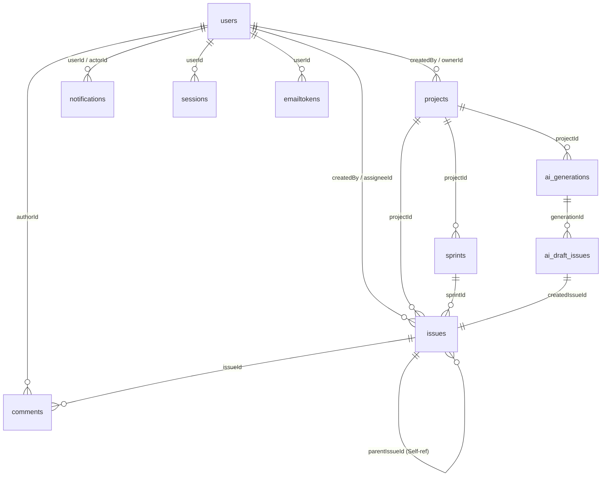

# PHÂN TÍCH CHI TIẾT CẤU TRÚC DATABASE V2 — DỰ ÁN TASKFLOW

Chào Khoa! Thầy/Anh đã đọc kỹ nội dung file [DATABASE_v2.docx](file:///N:/Intern%20FS/DATABASE_v2.docx) (được trích xuất tại [DATABASE_v2.txt](file:///N:/Intern%20FS/DATABASE_v2.txt)) và xây dựng bản phân tích chi tiết này. 

Dự án **TaskFlow** là một hệ thống quản lý công việc theo mô hình **Agile/Scrum** (có Epic, Sprint, Issue, Kanban Board) kết hợp với **tính năng AI** hỗ trợ sinh công việc tự động. Cơ sở dữ liệu được thiết kế trên **MongoDB** thông qua thư viện **Mongoose ODM**.

Dưới đây là phân tích từng bước, từ tổng quan đến chi tiết các nghiệp vụ cốt lõi để em dễ dàng nắm bắt và áp dụng vào code Backend Express.js của team nhé!

---

## PHẦN 1: TỔNG QUAN HỆ THỐNG DATABASE

Hệ thống bao gồm **11 Collections (bảng dữ liệu)** được chia làm 4 nhóm chức năng chính:

| Nhóm chức năng | Tên Collection | Vai trò trong hệ thống |
| :--- | :--- | :--- |
| **Quản trị & Dự án** | `users`<br>`projects` | Quản lý thông tin tài khoản người dùng và cấu trúc thành viên trong dự án. |
| **Quy trình Scrum** | `sprints`<br>`issues`<br>`comments` | Lõi của hệ thống quản lý công việc: Chu kỳ chạy (Sprint), Công việc (Epic/Task/Subtask/Bug) và bình luận. |
| **Hệ thống & Bảo mật** | `sessions`<br>`emailtokens`<br>`emailratelimits`<br>`notifications` | Quản lý phiên đăng nhập, gửi email OTP/Reset mật khẩu, giới hạn gửi thư chống spam và gửi thông báo. |
| **Tích hợp AI** | `ai_generations`<br>`ai_draft_issues` | Lưu vết quá trình AI sinh công việc và quản lý các công việc nháp do AI tạo ra chờ Quản lý dự án (PM) duyệt. |

---

## PHẦN 2: CÁC MỐI QUAN HỆ & CƠ CHẾ THIẾT KẾ ĐẶC BIỆT

MongoDB là cơ sở dữ liệu **NoSQL Document**, thiết kế ở đây sử dụng kết hợp giữa **Tham chiếu (References)** và **Nhúng tài liệu (Embedded Documents)** để tối ưu hóa hiệu năng truy vấn.



### 1. Cơ chế Nhúng (Embedded Document) trong `projects.members`
Thay vì tạo một bảng trung gian `project_members` riêng biệt, dự án chọn cách nhúng mảng thành viên trực tiếp vào trong Project Schema:
* **Ưu điểm:** Khi lấy thông tin chi tiết một dự án, ta lấy được luôn danh sách thành viên mà không cần dùng lệnh `$lookup` (phép JOIN trong MongoDB), giúp API chạy cực kỳ nhanh.
* **Cấu trúc nhúng:**
  ```javascript
  members: [{
    userId: ObjectId, // Tham chiếu tới users collection
    role: "PM" | "MEMBER",
    status: "PENDING" | "ACTIVE" | "REMOVED",
    joinedAt: Date
  }]
  ```

### 2. Sự khác biệt giữa `createdBy` và `ownerId` trong Project
* **`createdBy` (Người tạo):** Mang tính chất lịch sử (audit), lưu giữ thông tin ai là người tạo dự án ban đầu. Trường này là **bất biến** (không bao giờ thay đổi), ngay cả khi người này rời khỏi dự án.
* **`ownerId` (Chủ sở hữu hiện tại/PM chính):** Trỏ tới người chịu trách nhiệm chính hiện tại. Quyền xóa dự án hoặc phân quyền tối cao được gắn vào `ownerId`. Trường này **chuyển giao được**.
* **Logic rời nhóm (Leave Project):** 
  * Nếu PM chính (`ownerId`) muốn rời nhóm, họ phải chỉ định người kế nhiệm.
  * Nếu họ rời đi mà không chỉ định, hệ thống sẽ tự động thăng chức cho PM tham gia sớm nhất. Nếu không còn PM nào khác, thành viên (MEMBER) tham gia sớm nhất sẽ được thăng cấp lên PM và làm `ownerId` mới.
  * Nếu họ là người duy nhất trong dự án, hệ thống sẽ chặn không cho rời và yêu cầu phải xóa dự án.

---

## PHẦN 3: PHÂN TÍCH CHI TIẾT TỪNG COLLECTION & LOGIC NGHIỆP VỤ

### 1. Bảng `users` (Tài khoản người dùng)
* **Xác thực:** Hỗ trợ đăng nhập thường (`authProvider: 'local'`) và đăng nhập qua Google (`authProvider: 'google'`). 
* **Bảo mật:** `passwordHash` chỉ bắt buộc khi đăng nhập local. Khi API trả dữ liệu user về, Mongoose tự động cấu hình xóa trường `passwordHash` và `__v` để bảo mật dữ liệu.
* **Index:** Đánh chỉ mục `email` (`unique`) để tìm kiếm tài khoản nhanh và ngăn trùng lặp email. Đánh chỉ mục `googleId` (`partial unique`) đảm bảo những tài khoản đăng nhập Google không bị trùng, nhưng vẫn cho phép các tài khoản local (có `googleId` bằng `null`) tồn tại bình thường.

### 2. Bảng `projects` (Dự án)
* **Soft Delete (Xóa mềm):** Sử dụng trường `isDeleted` kiểu Boolean để ẩn dự án khi xóa, tránh mất mát dữ liệu vật lý.
* **Quy trình rời nhóm:** Khi một user rời dự án (status đổi thành `REMOVED`), Backend phải tự động cập nhật tất cả các Issue mà user đó đang làm (`assigneeId`) về `null` để tránh lỗi dữ liệu "mồ côi" (lỗi gán việc cho một người không còn trong dự án).

### 3. Bảng `sprints` (Chu kỳ Scrum)
* **Không xóa mềm:** Sprint sử dụng trạng thái `status` (`PLANNED/ACTIVE/COMPLETED/CANCELLED`) để quản lý vòng đời thay vì xóa mềm.
* **Logic kết thúc/gỡ Sprint:**
  * Những công việc chưa hoàn thành (`status != DONE`) sẽ được cập nhật trường `sprintId = null` (tức là đẩy ngược lại về Backlog dự án).
  * Những công việc đã hoàn thành (`status == DONE`) vẫn được giữ nguyên `sprintId` cũ để phục vụ tính toán **Velocity (vận tốc hoàn thành công việc)** của Sprint đó.

### 4. Bảng `issues` (Công việc)
Đây là bảng phức tạp và quan trọng nhất hệ thống.

* **Cơ chế Thùng rác (Soft Delete + TTL 7 ngày):**
  * Khi xóa một Issue, ta không xóa hẳn mà set `isDeleted = true` và `deletedAt = new Date()`.
  * MongoDB cấu hình **TTL Index** trên trường `deletedAt` với thời gian hết hạn là 7 ngày (`604800` giây). Sau đúng 7 ngày, MongoDB sẽ tự động xóa cứng bản ghi này khỏi cơ sở dữ liệu.
  * Nếu người dùng bấm khôi phục trong 7 ngày, ta chỉ cần set lại `isDeleted = false` và `deletedAt = null`.
* **Self-reference (Tự tham chiếu):** Trường `parentIssueId` chứa `_id` của chính một Issue khác trong bảng này. Nhờ đó, ta có thể xây dựng mối quan hệ phân cấp: **Epic $\to$ Task $\to$ Subtask**.
* **Cascade Delete (Xóa bắc cầu):** Khi người dùng xóa một Epic (Issue cha), backend phải viết code để tự động tìm và set `isDeleted = true` cho toàn bộ các Subtask (Issue con) của Epic đó để chúng cùng vào thùng rác.
* **Kanban Board:** Trường `orderIndex` kiểu Number được dùng để sắp xếp thứ tự hiển thị kéo thả các thẻ công việc trên bảng Kanban.
* **Logic PM từ chối duyệt:** Khi Task đang ở trạng thái kiểm thử (`IN_REVIEW`), nếu PM không duyệt và trả về (`TODO`), lý do từ chối sẽ được lưu vào trường `reason` và đồng thời bắn thông báo đến lập trình viên được gán (`assigneeId`).

### 5. Bảng `comments` (Bình luận)
* **Mentions:** Chứa danh sách các `userId` được tag trong bình luận (cú pháp `@username`). Khi có mention, hệ thống sẽ tự động quét mảng này để gửi thông báo (Notification) riêng với loại `MENTIONED`.
* **Index:** Thiết lập chỉ mục `{issueId: 1, createdAt: -1}` để khi người dùng mở một công việc, hệ thống truy vấn và sắp xếp các bình luận mới nhất lên đầu một cách nhanh nhất.

### 6. Bảng `sessions` & `emailtokens` (Xác thực và OTP)
* **Quản lý phiên đăng nhập:** `sessions` lưu trữ `refreshToken` của người dùng. Trường `expiresAt` được cấu hình TTL index (`expireAfterSeconds: 0`), nghĩa là ngay khi thời gian hiện tại vượt quá `expiresAt`, phiên đăng nhập đó sẽ tự động bị xóa khỏi DB, buộc user phải đăng nhập lại.
* **Email Token:** Lưu các mã xác thực email, lấy lại mật khẩu. Trường `userId` được thiết kế **Optional (không bắt buộc)** vì ở các luồng như Reset Password hay OTP Login, người dùng nhập email vào trước và hệ thống lúc đó có thể chưa xác định được `userId`.

### 7. Bảng `emailratelimits` (Chống spam email)
* Nhằm mục đích ngăn chặn việc người dùng click gửi email liên tục (spam API).
* Lưu trữ số lần thử (`attempts`) và thời gian bị chặn (`blockedUntil`). Nếu vượt quá giới hạn (ví dụ gửi quá 3 lần/phút), API sẽ từ chối gửi tiếp cho đến khi hết thời gian chặn.

### 8. Bảng `notifications` (Thông báo)
* **Người nhận vs Người thực hiện:** `userId` là người nhận thông báo, `actorId` là người gây ra hành động (ví dụ: PM gán task cho Dev $\to$ `userId` là Dev, `actorId` là PM). Nếu do hệ thống tự động gửi (ví dụ: Task sắp đến hạn), `actorId` sẽ là `null`.
* **Deep-link:** Sử dụng cặp trường `entityType` (loại đối tượng, ví dụ: `ISSUE`, `COMMENT`) và `entityId` (ID của đối tượng cụ thể) để khi người dùng click vào thông báo trên UI, ứng dụng Frontend React JS có thể điều hướng (routing) chính xác đến trang chi tiết của đối tượng đó.
* **Tự dọn dẹp:** Thông báo tự động bị xóa sau 30 ngày nhờ TTL index trên trường `expiresAt`.

### 9. Bảng `ai_generations` & `ai_draft_issues` (Tính năng AI sinh công việc)
Đây là thiết kế rất thông minh để tích hợp AI vào dự án quản lý công việc:
* **Quy trình hoạt động:**
  1. PM gửi yêu cầu mô tả dự án hoặc yêu cầu công việc (`inputPrompt`).
  2. Hệ thống gọi API của AI (OpenAI hoặc Anthropic) bất đồng bộ. Lúc này bản ghi `ai_generations` có trạng thái `PENDING` $\to$ `PROCESSING`.
  3. Sau khi AI trả kết quả thô (`rawOutput`), hệ thống chuyển trạng thái sang `COMPLETED`, lưu số lượng `tokensUsed` để quản lý chi phí, đồng thời tạo ra hàng loạt các **Issue nháp** trong bảng `ai_draft_issues` ở trạng thái gợi ý `SUGGESTED`.
  4. Hệ thống gửi Notification thông báo cho PM biết AI đã sinh xong. PM vào giao diện duyệt:
     * Đồng ý (`ACCEPTED`): Hệ thống tạo Issue thật trong bảng `issues` và lưu ID thật vào trường `createdIssueId` của bản ghi nháp.
     * Từ chối (`REJECTED`): Giữ nguyên trạng thái nháp.
* **Cơ chế `parentTempId` (Id tạm thời):**
  * Do AI sinh ra cả một cây thư mục công việc (Epic $\to$ Task $\to$ Subtask) cùng một lúc khi chưa có ID thật từ MongoDB.
  * AI sẽ đánh các nhãn tạm (ví dụ: `"temp_epic_1"`, `"temp_task_1"`). Trường `parentTempId` của task con sẽ trỏ tới nhãn tạm của epic cha.
  * Khi PM bấm duyệt, backend sẽ tạo các Issue cha trước để lấy `_id` thật, sau đó dùng `createdIssueId` làm cầu nối ánh xạ nhãn tạm để tạo các Issue con trỏ đúng vào `parentIssueId` thật.
* **Tự dọn dẹp nháp:** Các issue nháp không được duyệt sẽ tự động biến mất sau 7 ngày nhờ TTL index trên `expiresAt`.

---

## PHẦN 4: GIẢI THÍCH CÁC THUẬT NGỮ CHUYÊN NGÀNH (GLOSSARY)

Để giúp Khoa tích lũy thêm kiến thức thực chiến, dưới đây là định nghĩa ngắn gọn của các thuật ngữ xuất hiện trong thiết kế này:

1. **ODM (Object Data Modeling - ví dụ Mongoose):** Thư viện trung gian giúp lập trình viên viết code Javascript (định nghĩa class, schema) để giao tiếp với database MongoDB thay vì phải viết các câu lệnh truy vấn thô.
2. **Schema:** Lược đồ định nghĩa cấu trúc dữ liệu, các trường thông tin, kiểu dữ liệu (String, Number, Date,...) và các ràng buộc đi kèm (ví dụ: required, unique).
3. **Embedded Document (Tài liệu nhúng):** Lưu tài liệu con nằm trực tiếp trong tài liệu cha dưới dạng một Object hoặc Array Object thay vì lưu ở bảng khác rồi liên kết.
4. **Soft Delete (Xóa mềm):** Kỹ thuật ẩn bản ghi bằng cách dùng cờ đánh dấu (như `isDeleted = true`) thay vì xóa vĩnh viễn khỏi ổ đĩa. Giúp tránh mất mát dữ liệu và dễ khôi phục.
5. **TTL Index (Time-To-Live Index):** Tính năng tự động xóa dữ liệu của MongoDB sau một khoảng thời gian được định sẵn dựa trên một trường thời gian.
6. **Cascade (Lan truyền):** Hành động tự động thực hiện trên các bản ghi con khi bản ghi cha bị tác động (ví dụ: xóa cha thì tự động xóa hết con).
7. **Self-reference (Tự tham chiếu):** Một bảng có trường liên kết trỏ ngược lại chính bản thân nó (như công việc con liên kết tới công việc cha).
8. **Deep-link (Liên kết sâu):** Đường dẫn trỏ trực tiếp đến một nội dung cụ thể sâu bên trong ứng dụng (ví dụ: click thông báo mở trực tiếp màn hình chi tiết Task thay vì chỉ vào trang chủ).
9. **Rate Limiting:** Cơ chế giới hạn số lượng yêu cầu (request) gửi tới máy chủ trong một khoảng thời gian nhất định để tránh quá tải hoặc spam.

---

## PHẦN 5: LỜI KHUYÊN THỰC CHIẾN KHI LẬP TRÌNH (MENTOR'S TIPS)

Khi tiến hành viết code backend Express.js và frontend React.js cho cấu trúc database này, team em cần đặc biệt lưu ý:

1. **Khi viết Middleware kiểm tra quyền:** Hãy nhớ kiểm tra quyền PM dựa trên `projects.members.role` của dự án đó, đồng thời quyền cao nhất (như xóa dự án) phải kiểm tra xem `req.user._id` có khớp với `projects.ownerId` hay không.
2. **Khi viết API xóa Issue:** Không dùng hàm `.findByIdAndDelete()` mà hãy dùng `.findByIdAndUpdate()` để set `isDeleted: true` và `deletedAt: new Date()`. Đồng thời phải viết một hàm phụ (helper) để quét các subtask con và xóa mềm chúng theo (Cascade).
3. **Khi làm tính năng duyệt AI:** Viết hàm xử lý duyệt tuần tự hoặc sử dụng Mongoose Transaction để đảm bảo nếu quá trình tạo công việc thật từ nháp bị lỗi ở bước nào thì toàn bộ quá trình sẽ được roll-back (hủy bỏ), tránh việc tạo ra các task cha mà không có task con hoặc ngược lại.
4. **Khi query danh sách Kanban:** Đừng quên lọc `{ isDeleted: false }` trong tất cả các câu lệnh tìm kiếm dự án, sprint hoặc issue để tránh hiển thị nhầm các dữ liệu đã bị xóa mềm vào thùng rác.

---

Chúc Khoa và team phát triển dự án TaskFlow thật thành công! Nếu có phần nào trong code Express.js/React.js chưa rõ cách map với database này, cứ thoải mái hỏi anh/thầy nhé!
