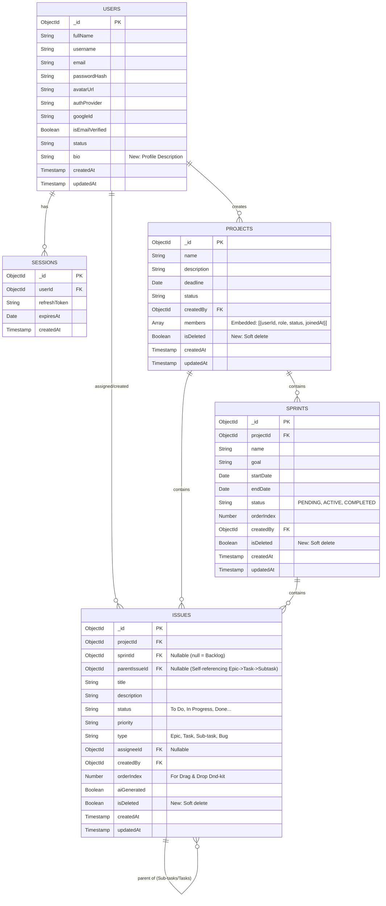

```mermaid
erDiagram
    USERS ||--o{ SESSIONS : "has"
    USERS ||--o{ PROJECTS : "creates"
    USERS ||--o{ ISSUES : "assigned/created"
    PROJECTS ||--o{ SPRINTS : "contains"
    PROJECTS ||--o{ ISSUES : "contains"
    SPRINTS ||--o{ ISSUES : "contains"
    ISSUES ||--o{ ISSUES : "parent of (Sub-tasks/Tasks)"

    USERS {
        ObjectId _id PK
        String fullName
        String username
        String email
        String passwordHash
        String avatarUrl
        String authProvider
        String googleId
        Boolean isEmailVerified
        String status
        String bio "New: Profile Description"
        Timestamp createdAt
        Timestamp updatedAt
    }

    SESSIONS {
        ObjectId _id PK
        ObjectId userId FK
        String refreshToken
        Date expiresAt
        Timestamp createdAt
    }

    PROJECTS {
        ObjectId _id PK
        String name
        String description
        Date deadline
        String status
        ObjectId createdBy FK
        Array members "Embedded: [{userId, role, status, joinedAt}]"
        Boolean isDeleted "New: Soft delete"
        Timestamp createdAt
        Timestamp updatedAt
    }

    SPRINTS {
        ObjectId _id PK
        ObjectId projectId FK
        String name
        String goal
        Date startDate
        Date endDate
        String status "PENDING, ACTIVE, COMPLETED"
        Number orderIndex
        ObjectId createdBy FK
        Boolean isDeleted "New: Soft delete"
        Timestamp createdAt
        Timestamp updatedAt
    }

    ISSUES {
        ObjectId _id PK
        ObjectId projectId FK
        ObjectId sprintId FK "Nullable (null = Backlog)"
        ObjectId parentIssueId FK "Nullable (Self-referencing Epic->Task->Subtask)"
        String title
        String description
        String status "To Do, In Progress, Done..."
        String priority
        String type "Epic, Task, Sub-task, Bug"
        ObjectId assigneeId FK "Nullable"
        ObjectId createdBy FK
        Number orderIndex "For Drag & Drop Dnd-kit"
        Boolean aiGenerated
        Boolean isDeleted "New: Soft delete"
        Timestamp createdAt
        Timestamp updatedAt
    }
```
