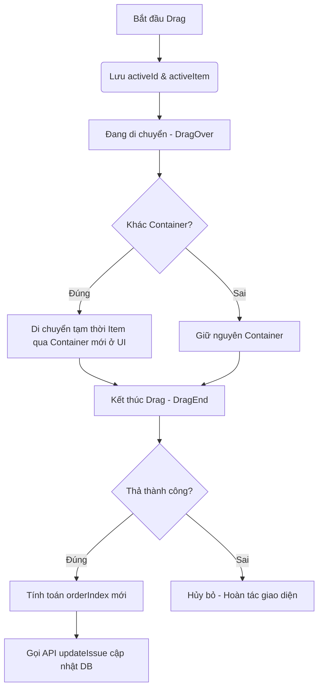

# BẢN PHÂN TÍCH GIẢI PHÁP KÉO THẢ (DRAG & DROP) CHO KANBAN BOARD & BACKLOG

Chào Khoa! Yêu cầu của bạn về việc thực hiện chức năng kéo thả cho cả **Board** và **Backlog** bằng thư viện **dnd-kit** là một bài toán rất thực tế và cực kỳ quan trọng trong các dự án quản lý dự án (như Jira, Trello). 

Dưới đây là bản phân tích chi tiết, thiết kế giải pháp và lộ trình triển khai từng bước (step-by-step) dành cho bạn.

---

## 1. PHÂN TÍCH YÊU CẦU & THÔNG SỐ KỸ THUẬT

### 1.1. Bộ lọc loại Issue
* **Yêu cầu:** Chỉ hiển thị `task`, không hiển thị `epic` và `subtask`.
* **Giải pháp:** Trong code Frontend hiện tại, hàm fetch dữ liệu `useProjectIssues(projectId)` trả về tất cả các issue của project. Chúng ta cần lọc danh sách này trước khi đưa vào các container kéo thả:
  ```typescript
  const taskIssues = issues.filter(
    (issue) => issue.type !== 'EPIC' && issue.type !== 'SUBTASK'
  );
  ```
  *(Điều này đảm bảo chúng ta hiển thị các issue dạng `TASK` và `BUG` bình thường).*

### 1.2. Logic Kéo Thả (2 Handlers)
Chúng ta sẽ có 2 môi trường kéo thả khác nhau với logic cập nhật dữ liệu tương ứng:

| Môi trường | Container đại diện | Kéo thả trong cùng Container | Kéo thả sang Container khác |
| :--- | :--- | :--- | :--- |
| **Kanban Board** | Các cột trạng thái (`status`: `TODO`, `IN_PROGRESS`, `IN_REVIEW`, `DONE`) | Đổi vị trí sắp xếp trong cột $\rightarrow$ **Cập nhật `orderIndex`** | Đổi cột trạng thái $\rightarrow$ **Cập nhật `status`** mới + **Cập nhật `orderIndex`** mới |
| **Backlog** | Các Sprint (`sprintId`: `sprint_id_1`, `sprint_id_2`, ..., hoặc `null` cho Backlog chung) | Đổi vị trí sắp xếp trong Sprint $\rightarrow$ **Cập nhật `orderIndex`** | Chuyển sang Sprint khác $\rightarrow$ **Cập nhật `sprintId`** mới + **Cập nhật `orderIndex`** mới |

---

## 2. THUẬT TOÁN "BƯỚC NHẢY 1000" (STEP 1000)

### 2.1. Tại sao cần sử dụng?
Trong cơ sở dữ liệu, nếu ta đánh chỉ số thứ tự là `1, 2, 3, 4`:
* Khi di chuyển phần tử thứ 4 vào giữa phần tử 1 và 2, ta sẽ có thứ tự mới: `1, 4 (thành 2), 2 (thành 3), 3 (thành 4)`.
* Điều này bắt buộc ta phải gửi API cập nhật lại chỉ số cho **tất cả các phần tử phía sau** (Bulk Update). Nếu danh sách có hàng ngàn task, hiệu năng DB sẽ bị ảnh hưởng nghiêm trọng.

**Giải pháp:** Sử dụng bước nhảy 1000. Ban đầu, các phần tử có chỉ số cách nhau 1000 đơn vị (ví dụ: `1000, 2000, 3000, 4000`).

### 2.2. Cách tính toán `orderIndex` mới khi di chuyển phần tử
Khi kéo một item và thả vào vị trí mới trong danh sách đích (sau khi đã sắp xếp theo `orderIndex` tăng dần):

1. **Thả vào đầu danh sách (Vị trí đầu tiên):**
   * Nếu danh sách đích trống: `newOrderIndex = 1000`
   * Nếu danh sách đích đã có phần tử đầu tiên là $Item_{first}$: 
     $$\text{newOrderIndex} = \text{orderIndex}(Item_{first}) - 1000$$

2. **Thả vào cuối danh sách (Vị trí cuối cùng):**
   * Nếu danh sách đích đã có phần tử cuối cùng là $Item_{last}$: 
     $$\text{newOrderIndex} = \text{orderIndex}(Item_{last}) + 1000$$

3. **Thả vào giữa hai phần tử ($Item_{prev}$ và $Item_{next}$):**
   * Tính trung bình cộng của 2 phần tử liền kề:
     $$\text{newOrderIndex} = \frac{\text{orderIndex}(Item_{prev}) + \text{orderIndex}(Item_{next})}{2}$$
   * *Ví dụ:* Chèn vào giữa `1000` và `2000` $\rightarrow$ `1500`. Chèn tiếp vào giữa `1000` và `1500` $\rightarrow$ `1250`.

> [!TIP]
> **Ưu điểm vượt trội:** Với cách này, mỗi lần kéo thả, chúng ta **chỉ cần gọi API cập nhật đúng 1 phần tử duy nhất** vừa kéo. Hiệu năng cơ sở dữ liệu sẽ cực kỳ tối ưu!

---

## 3. THIẾT KẾ COMPONENT DÙNG CHUNG VỚI `dnd-kit`

Vì giao diện của Kanban Board (dạng cột dọc) và Backlog (dạng hàng ngang) rất khác nhau, nhưng cơ chế logic kéo thả lại tương đồng (đều có Container chứa các Item có thể sort), ta nên thiết kế một **DndContext Wrapper dùng chung** để đóng gói toàn bộ logic kéo thả.

### Sơ đồ luồng hoạt động (Mermaid):


### 3.1. Thiết kế component `<DndContainerWrapper />`
Component này sẽ nhận các props:
* `items`: Danh sách các items (mảng phẳng các Issue).
* `containerIds`: Mảng các ID đại diện cho container (vd: `['TODO', 'IN_PROGRESS', ...]` đối với Board; hoặc các `sprintId` đối với Backlog).
* `onMoveItem`: Callback xử lý khi người dùng kết thúc kéo thả, nhận về thông tin `issueId`, `targetContainerId` (status hoặc sprintId mới) và `newOrderIndex`.
* `renderContainer`: Hàm render giao diện cho từng container.

---

## 4. KẾ HOẠCH TRIỂN KHAI TỪNG BƯỚC (STEP-BY-STEP)

Để làm tính năng này, Khoa hãy thực hiện theo 6 bước cụ thể sau:

### Bước 1: Cài đặt các thư viện cần thiết cho Frontend
Chạy lệnh cài đặt bộ ba thư viện `@dnd-kit` trong thư mục `frontend`:
```bash
npm install @dnd-kit/core @dnd-kit/sortable @dnd-kit/utilities
```

### Bước 2: Viết Helper tính toán `orderIndex`
Tạo một file utility để xử lý thuật toán tính toán `orderIndex` mới nhằm tái sử dụng cho cả Board và Backlog:
* File đề xuất: `frontend/src/lib/dndHelpers.ts`
* Hàm cần viết: `calculateOrderIndex(sortedItems: Issue[], overIndex: number, activeIndex: number): number`

### Bước 3: Tạo Component DndWrapper dùng chung
* File đề xuất: `frontend/src/components/ui/dnd/DndSortableWrapper.tsx`
* Sử dụng `DndContext` từ `@dnd-kit/core` để bắt sự kiện drag.
* Sử dụng `SortableContext` từ `@dnd-kit/sortable` cho các danh sách có thể sắp xếp.
* Sử dụng `useSortable` trong component Card để biến nó thành phần tử kéo thả được.

### Bước 4: Tích hợp vào Kanban Board (`ProjectBoard.tsx`)
1. Lọc dữ liệu: Chỉ giữ lại các task (`type !== 'EPIC' && type !== 'SUBTASK'`).
2. Bao bọc các cột trong `DndSortableWrapper`.
3. Biến mỗi cột thành một container (Droppable).
4. Biến `IssueCard.tsx` thành phần tử có thể kéo thả (Sortable).
5. Xử lý hàm callback cập nhật DB khi kéo thả:
   * Nếu đổi status: Gọi API cập nhật `{ status: newStatus, orderIndex: newOrder }`.
   * Nếu cùng status: Gọi API cập nhật `{ orderIndex: newOrder }`.

### Bước 5: Tích hợp vào Backlog Tab (`ProjectBacklogTab.tsx`)
1. Lọc dữ liệu: Tương tự như Board, chỉ hiển thị Task.
2. Tạo các container tương ứng với: **Sprint hiện tại** (`sprintId` cụ thể) và **Backlog chung** (`sprintId = null`).
3. Tích hợp `DndSortableWrapper` bao bọc bên ngoài.
4. Biến từng dòng issue trong Backlog thành các phần tử Sortable.
5. Xử lý hàm callback khi kết thúc kéo thả:
   * Nếu đổi Sprint: Gọi API cập nhật `{ sprintId: newSprintId, orderIndex: newOrder }`.
   * Nếu trong cùng Sprint: Gọi API cập nhật `{ orderIndex: newOrder }`.

### Bước 6: Kiểm tra và tối ưu trải nghiệm (UX/UI)
* Thêm hiệu ứng di chuột (hover cursor) và trạng thái mờ (opacity) khi đang kéo.
* Thêm component `<DragOverlay>` để card có hiệu ứng bay theo chuột mượt mà hơn khi đang di chuyển.
