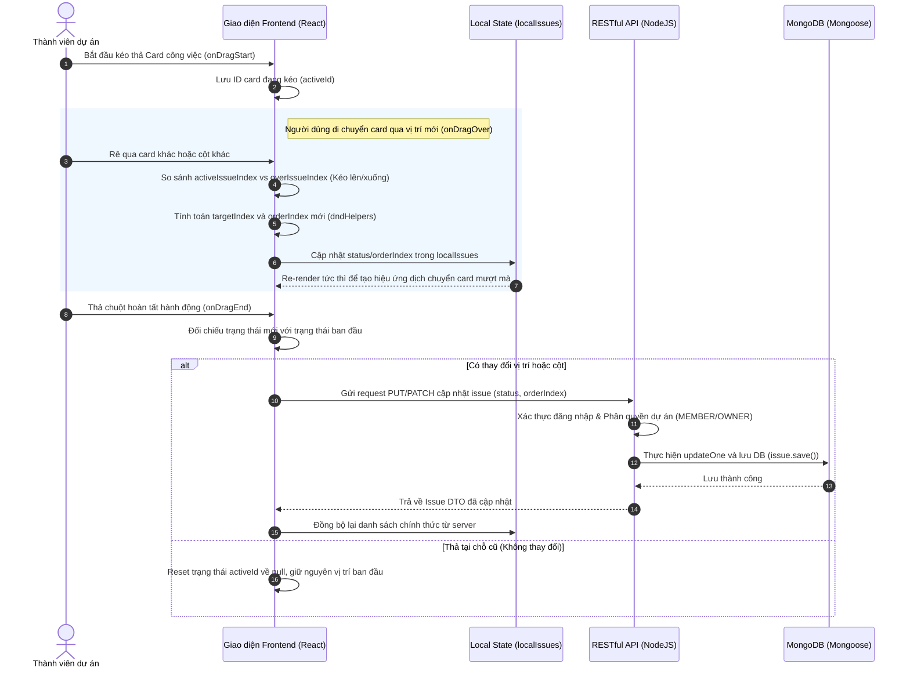

# BẢN PHÂN TÍCH KỸ THUẬT CHI TIẾT: 8 USER STORIES CỐT LÕI (TASKFLOW)

Tài liệu này cung cấp cái nhìn chi tiết về cách 8 User Stories cốt lõi của hệ thống quản lý công việc **TaskFlow** được hiện thực hóa trong mã nguồn thực tế (Frontend & Backend), cùng các cơ chế bảo mật, hướng dẫn chuyên sâu về thư viện kéo thả **dnd-kit** và sơ đồ luồng đi kèm.

---

## TỔNG QUAN HỆ THỐNG PHÂN QUYỀN & MÔ HÌNH DỮ LIỆU
Dự án sử dụng cơ chế bảo mật phân tầng:
1. **Authentication (Xác thực):** Kiểm tra trạng thái đăng nhập qua token JWT bằng [authMiddleware.js](file:///N:/Intern%20FS/Clone GIt/dn26_cpl_nodejs_01_nhom-2/backend/src/middlewares/authMiddleware.js).
2. **Authorization (Phân quyền):** Kiểm tra vai trò của người dùng đối với từng dự án cụ thể qua [projectAuthMiddleware.js](file:///N:/Intern%20FS/Clone GIt/dn26_cpl_nodejs_01_nhom-2/backend/src/middlewares/projectAuthMiddleware.js). 
   * **OWNER (PM):** Có toàn quyền cấu hình dự án, mời thành viên, tạo/sửa/xóa issue.
   * **MEMBER (Thành viên):** Có quyền xem dự án, xem danh sách công việc và cập nhật trạng thái thẻ công việc (kéo thả Kanban).

---

## 🚀 BẢNG TRA CỨU API ENDPOINTS & CONTROLLERS BACKEND CHO 8 USER STORIES

Mọi request từ Frontend sẽ đi qua tuyến đường:
`app.use('/api', apiRoutes)` ở [server.js](file:///N:/Intern%20FS/Clone%20GIt/dn26_cpl_nodejs_01_nhom-2/backend/src/server.js#L29) $\rightarrow$ [api.js](file:///N:/Intern%20FS/Clone%20GIt/dn26_cpl_nodejs_01_nhom-2/backend/src/routes/api.js) $\rightarrow$ Route thành phần $\rightarrow$ Controller tương ứng.

| User Story | Chức năng (Feature) | Phương thức & URL (API Endpoint) | File Route | Controller Function & File |
| :--- | :--- | :--- | :--- | :--- |
| **US1** | Đăng ký tài khoản | `POST /api/auth/sign-up` | [authRoute.js](file:///N:/Intern%20FS/Clone%20GIt/dn26_cpl_nodejs_01_nhom-2/backend/src/routes/authRoute.js#L28) | `signUp` - [authController.js](file:///N:/Intern%20FS/Clone%20GIt/dn26_cpl_nodejs_01_nhom-2/backend/src/controllers/authController.js#L15) |
| **US1** | Đăng nhập hệ thống | `POST /api/auth/sign-in` | [authRoute.js](file:///N:/Intern%20FS/Clone%20GIt/dn26_cpl_nodejs_01_nhom-2/backend/src/routes/authRoute.js#L34) | `signIn` - [authController.js](file:///N:/Intern%20FS/Clone%20GIt/dn26_cpl_nodejs_01_nhom-2/backend/src/controllers/authController.js#L54) |
| **US1** | Lấy / Cập nhật Hồ sơ | `GET/PATCH /api/auth/me` | [authRoute.js](file:///N:/Intern%20FS/Clone%20GIt/dn26_cpl_nodejs_01_nhom-2/backend/src/routes/authRoute.js#L43) | `getMe`, `updateMe` - [authController.js](file:///N:/Intern%20FS/Clone%20GIt/dn26_cpl_nodejs_01_nhom-2/backend/src/controllers/authController.js#L95) |
| **US1** | Đổi mật khẩu | `PATCH /api/auth/change-password` | [authRoute.js](file:///N:/Intern%20FS/Clone%20GIt/dn26_cpl_nodejs_01_nhom-2/backend/src/routes/authRoute.js#L49) | `changePassword` - [authController.js](file:///N:/Intern%20FS/Clone%20GIt/dn26_cpl_nodejs_01_nhom-2/backend/src/controllers/authController.js#L81) |
| **US2** | Tạo dự án mới | `POST /api/projects` | [projectRoute.js](file:///N:/Intern%20FS/Clone%20GIt/dn26_cpl_nodejs_01_nhom-2/backend/src/routes/projectRoute.js#L27) | `createProject` - [projectController.js](file:///N:/Intern%20FS/Clone%20GIt/dn26_cpl_nodejs_01_nhom-2/backend/src/controllers/projectController.js#L12) |
| **US2** | Xem danh sách / chi tiết | `GET /api/projects` & `GET /api/projects/:projectId` | [projectRoute.js](file:///N:/Intern%20FS/Clone%20GIt/dn26_cpl_nodejs_01_nhom-2/backend/src/routes/projectRoute.js#L30) | `getMyProjects`, `getProjectById` - [projectController.js](file:///N:/Intern%20FS/Clone%20GIt/dn26_cpl_nodejs_01_nhom-2/backend/src/controllers/projectController.js#L34) |
| **US3** | Mời thành viên dự án | `POST /api/projects/:projectId/members/invite` | [projectRoute.js](file:///N:/Intern%20FS/Clone%20GIt/dn26_cpl_nodejs_01_nhom-2/backend/src/routes/projectRoute.js#L51) | `inviteMembers` - [projectController.js](file:///N:/Intern%20FS/Clone%20GIt/dn26_cpl_nodejs_01_nhom-2/backend/src/controllers/projectController.js#L23) |
| **US3** | Chấp nhận / từ chối mời | `POST /api/projects/:projectId/invitation/accept` | [projectRoute.js](file:///N:/Intern%20FS/Clone%20GIt/dn26_cpl_nodejs_01_nhom-2/backend/src/routes/projectRoute.js#L80) | `acceptInvitation` - [projectController.js](file:///N:/Intern%20FS/Clone%20GIt/dn26_cpl_nodejs_01_nhom-2/backend/src/controllers/projectController.js#L119) |
| **US4** | Tạo & Bắt đầu Sprint | `POST /api/projects/:projectId/sprints` | [sprintRoute.js](file:///N:/Intern%20FS/Clone%20GIt/dn26_cpl_nodejs_01_nhom-2/backend/src/routes/sprintRoute.js#L33) | `createSprint`, `startSprint` - [sprintController.js](file:///N:/Intern%20FS/Clone%20GIt/dn26_cpl_nodejs_01_nhom-2/backend/src/controllers/sprintController.js#L12) |
| **US5** | Tạo công việc & Backlog | `POST /api/projects/:projectId/issues` | [issueRoute.js](file:///N:/Intern%20FS/Clone%20GIt/dn26_cpl_nodejs_01_nhom-2/backend/src/routes/issueRoute.js#L39) | `createIssue`, `getIssuesByProject` - [issueController.js](file:///N:/Intern%20FS/Clone%20GIt/dn26_cpl_nodejs_01_nhom-2/backend/src/controllers/issueController.js#L12) |
| **US6** | Kéo thả Kanban | `PATCH /api/projects/:projectId/issues/:issueId/status` | [issueRoute.js](file:///N:/Intern%20FS/Clone%20GIt/dn26_cpl_nodejs_01_nhom-2/backend/src/routes/issueRoute.js#L52) | `updateIssueStatus` - [issueController.js](file:///N:/Intern%20FS/Clone%20GIt/dn26_cpl_nodejs_01_nhom-2/backend/src/controllers/issueController.js#L61) |
| **US7** | Quản trị Admin hệ thống | `GET/PUT/DELETE /api/admin/users` | [userRoute.js](file:///N:/Intern%20FS/Clone%20GIt/dn26_cpl_nodejs_01_nhom-2/backend/src/routes/userRoute.js#L17) | `getAllUsers`, `updateUser` - [userController.js](file:///N:/Intern%20FS/Clone%20GIt/dn26_cpl_nodejs_01_nhom-2/backend/src/controllers/userController.js#L10) |
| **US8** | Lưu trữ / Khôi phục project | `GET/PATCH /api/projects/archived` | [projectRoute.js](file:///N:/Intern%20FS/Clone%20GIt/dn26_cpl_nodejs_01_nhom-2/backend/src/routes/projectRoute.js#L34) | `getArchivedProjects`, `restoreProject` - [projectController.js](file:///N:/Intern%20FS/Clone%20GIt/dn26_cpl_nodejs_01_nhom-2/backend/src/controllers/projectController.js#L81) |
| **US9** | Lọc danh sách Issue | `GET /api/projects/:projectId/issues` | [issueRoute.js](file:///N:/Intern%20FS/Clone%20GIt/dn26_cpl_nodejs_01_nhom-2/backend/src/routes/issueRoute.js#L21) | `getIssuesByProject` - [issueController.js](file:///N:/Intern%20FS/Clone%20GIt/dn26_cpl_nodejs_01_nhom-2/backend/src/controllers/issueController.js#L24) |
| **US10** | Xem Chi tiết Issue | `GET /api/projects/:projectId/issues/:issueId` | [issueRoute.js](file:///N:/Intern%20FS/Clone%20GIt/dn26_cpl_nodejs_01_nhom-2/backend/src/routes/issueRoute.js#L32) | `getIssueById` - [issueController.js](file:///N:/Intern%20FS/Clone%20GIt/dn26_cpl_nodejs_01_nhom-2/backend/src/controllers/issueController.js#L35) |

---

## HƯỚNG DẪN KỸ THUẬT VỀ THƯ VIỆN KÉO THẢ DND-KIT

### 1. Khái niệm và Kiến trúc Modular
**`@dnd-kit`** là bộ công cụ kéo và thả (Drag and Drop - DnD) hiện đại, gọn nhẹ và tối ưu hiệu năng dành riêng cho React. Khác với các thư viện nguyên khối truyền thống, `@dnd-kit` được thiết kế theo dạng **modular**. Hệ thống được chia nhỏ thành nhiều gói độc lập giúp giảm thiểu kích thước bundle size:
*   `@dnd-kit/core`: Cung cấp các khối xây dựng cốt lõi (`DndContext`, các bộ cảm biến, `useDraggable`, `useDroppable`, `DragOverlay`).
*   `@dnd-kit/sortable`: Cung cấp các thuật toán và hook chuyên dùng để sắp xếp thứ tự danh sách hoặc lưới (`useSortable`, `SortableContext`).
*   `@dnd-kit/utilities`: Cung cấp các hàm bổ trợ xử lý vị trí và chuyển đổi CSS (`CSS.Transform`).

### 2. Các thành phần cốt lõi
*   **`DndContext` (Hộp điều phối):** Đóng vai trò là "bộ não" quản lý luồng kéo thả. Nó bao bọc toàn bộ khu vực Kanban, lắng nghe các tương tác và cung cấp các hàm bắt sự kiện (`onDragStart`, `onDragOver`, `onDragEnd`, `onDragCancel`).
*   **`Sensors` (Bộ cảm biến tương tác):** Định nghĩa cách thức người dùng kích hoạt hành động kéo thả. Giúp hệ thống phân biệt thao tác click thông thường và thao tác kéo:
    *   `MouseSensor`: Chỉ bắt đầu kéo khi di chuyển chuột quá `5px`.
    *   `TouchSensor`: Yêu cầu nhấn giữ màn hình cảm ứng `250ms` trước khi di chuyển để tránh xung đột với hành động cuộn trang.
*   **`useSortable`:** Hook đặc biệt kết hợp cả tính năng kéo và thả cho các danh sách cần đổi chỗ thứ tự. Nó tính toán các thuộc tính CSS biến đổi (`transform` và `transition`) để dịch chuyển mượt mờ các thẻ xung quanh nhường chỗ cho thẻ đang kéo.
*   **`DragOverlay`:** Khi kéo, thẻ gốc dưới danh sách sẽ biến thành placeholder (nét đứt), còn thẻ hiển thị di chuyển theo chuột là một bản sao ảo được render trong `DragOverlay`.

---

## PHÂN TÍCH SÂU LUỒNG DỮ LIỆU 5 BƯỚC (DEEP-DIVE DATA FLOW) THEO TỪNG USER STORY

Dưới đây là mô tả chi tiết từng bước đi của dữ liệu từ khi kích hoạt trên giao diện Frontend $\rightarrow$ Gửi request $\rightarrow$ Xử lý ở Backend $\rightarrow$ Ghi nhận vào Database $\rightarrow$ Phản hồi của Backend $\rightarrow$ Cập nhật hiển thị ở Frontend.

---

### USER STORY 1: Tạo dự án mới theo mô hình Kanban hoặc Scrum
> **Yêu cầu:** *Là người dùng đã đăng nhập, tôi muốn tạo dự án theo mô hình Kanban hoặc Scrum để áp dụng quy trình quản lý phù hợp cho nhóm.*

```
[UI Wizard] --(POST /projects)--> [Express Router & Middleware] --> [Project Service]
                                                                          |
[Workspace Redirect] <--(JSON DTO + HTTP 201)-- [Response] <--(Mongoose)--+--> [MongoDB (projects)]
```

*   **Bước 1: Frontend Gửi Thông Tin (Component & Trigger)**
    *   **Component kích hoạt:** [ProjectSetupWizard.tsx](file:///N:/Intern%20FS/Clone GIt/dn26_cpl_nodejs_01_nhom-2/frontend/src/features/projects/pages/ProjectSetupWizard.tsx)
    *   **Hàm trigger:** Khi người dùng nhấn nút "Khởi tạo không gian" ở bước cuối, hàm `handleFinish()` được gọi.
    *   **Hook & API:** Gọi mutation `useCreateProject` thực thi gọi Axios `POST /projects`.
    *   **Header:** `Authorization: Bearer <JWT_Token>`
    *   **Request Payload (JSON):**
        ```json
        {
          "name": "Dự án Quản lý Bán hàng Online",
          "key": "QLBH",
          "methodology": "SCRUM",
          "description": "Dự án Scrum phát triển website bán hàng"
        }
        ```

*   **Bước 2: Backend Nhận Thông Tin (Routing & Middleware)**
    *   **API Endpoint:** `POST /api/projects` (chuyển hướng qua [server.js:L29](file:///N:/Intern%20FS/Clone%20GIt/dn26_cpl_nodejs_01_nhom-2/backend/src/server.js#L29) $\rightarrow$ [api.js:L16](file:///N:/Intern%20FS/Clone%20GIt/dn26_cpl_nodejs_01_nhom-2/backend/src/routes/api.js#L16)).
    *   **Route khai báo:** [projectRoute.js:L27](file:///N:/Intern%20FS/Clone%20GIt/dn26_cpl_nodejs_01_nhom-2/backend/src/routes/projectRoute.js#L27) (`router.post('/', createProject)`).
    *   **Middleware bảo mật:** Chạy qua `protectedRoute` tại [authMiddleware.js](file:///N:/Intern%20FS/Clone%20GIt/dn26_cpl_nodejs_01_nhom-2/backend/src/middlewares/authMiddleware.js) để giải mã token JWT, trích xuất ID tài khoản và gán vào `req.user._id`.
    *   **Controller thực thi:** Hàm `createProject` tại [projectController.js:L12](file:///N:/Intern%20FS/Clone%20GIt/dn26_cpl_nodejs_01_nhom-2/backend/src/controllers/projectController.js#L12) tiếp nhận `req.body`, kiểm tra dữ liệu đầu vào và chuyển sang tầng Service.

*   **Bước 3: Tương Tác Cơ Sở Dữ Liệu (Mongoose & MongoDB)**
    *   **Service xử lý:** `createProject` trong [projectService.js](file:///N:/Intern%20FS/Clone GIt/dn26_cpl_nodejs_01_nhom-2/backend/src/services/projectService.js#L58).
    *   **Mongoose Query thực thi:**
        ```javascript
        const project = await Project.create({
          name: "Dự án Quản lý Bán hàng Online",
          key: "QLBH", // Được sinh tự động nếu bỏ trống
          methodology: "SCRUM",
          description: "Dự án Scrum phát triển website bán hàng",
          createdBy: req.user._id,
          members: [{ userId: req.user._id, role: "OWNER", status: "ACTIVE" }] // Tự động làm OWNER
        })
        ```
    *   **MongoDB Operation:** Ghi một document mới vào collection `projects`.

*   **Bước 4: Backend Trả Về Thông Tin (Response DTO)**
    *   **HTTP Status Code:** `201 Created`
    *   **Response Body (JSON DTO):**
        ```json
        {
          "_id": "65c8f123abc456def7890123",
          "name": "Dự án Quản lý Bán hàng Online",
          "key": "QLBH",
          "methodology": "SCRUM",
          "description": "Dự án Scrum phát triển website bán hàng",
          "status": "ACTIVE",
          "createdBy": "65c8f000aaa111bbb2223333",
          "members": [
            { "userId": "65c8f000aaa111bbb2223333", "role": "OWNER", "status": "ACTIVE", "joinedAt": "2026-07-16T02:30:00.000Z" }
          ],
          "issueSeq": 0,
          "createdAt": "2026-07-16T02:30:00.000Z",
          "updatedAt": "2026-07-16T02:30:00.000Z"
        }
        ```

*   **Bước 5: Frontend Nhận & Hiển Thị (Cache Sync & Re-render)**
    *   **React Query Cache Sync:** Trong `onSuccess` của mutation, React Query lưu bản ghi vừa nhận được vào cache dữ liệu của nhóm query key `['projects']`.
    *   **UI Re-render:** Thực hiện chuyển hướng người dùng sang trang Workspace `/projects/65c8f123abc456def7890123`.

---

### USER STORY 2: Xem danh sách dự án tham gia
> **Yêu cầu:** *Là thành viên dự án, tôi muốn xem danh sách các dự án mình đang tham gia để nhanh chóng lựa chọn không gian làm việc phù hợp.*

```
[ProjectsView] --(GET /projects)--> [Express Router & Middleware] --> [Project Service]
                                                                           |
[Render Project Cards] <--(JSON Array + HTTP 200)-- [Response] <--(Mongoose)-+--> [MongoDB (projects)]
```

*   **Bước 1: Frontend Gửi Thông Tin (Component & Trigger)**
    *   **Component kích hoạt:** [ProjectsView.tsx](file:///N:/Intern%20FS/Clone GIt/dn26_cpl_nodejs_01_nhom-2/frontend/src/features/projects/components/ProjectsView.tsx)
    *   **Hàm trigger:** Khi trang `/projects` được load, hook `useProjects` tự động kích hoạt.
    *   **API Call:** Gửi request `GET /projects`.
    *   **Header:** Gửi kèm token JWT đã lưu ở localStorage qua Header: `Authorization: Bearer <JWT_Token>`.

*   **Bước 2: Backend Nhận Thông Tin (Routing & Middleware)**
    *   **API Endpoint:** `GET /api/projects`
    *   **Route khai báo:** [projectRoute.js:L30](file:///N:/Intern%20FS/Clone%20GIt/dn26_cpl_nodejs_01_nhom-2/backend/src/routes/projectRoute.js#L30) (`router.get('/', getMyProjects)`).
    *   **Middleware bảo mật:** Chạy qua `protectedRoute` tại [authMiddleware.js](file:///N:/Intern%20FS/Clone%20GIt/dn26_cpl_nodejs_01_nhom-2/backend/src/middlewares/authMiddleware.js) để trích xuất `req.user._id`.
    *   **Controller thực thi:** Hàm `getMyProjects` tại [projectController.js:L34](file:///N:/Intern%20FS/Clone%20GIt/dn26_cpl_nodejs_01_nhom-2/backend/src/controllers/projectController.js#L34).

*   **Bước 3: Tương Tác Cơ Sở Dữ Liệu (Mongoose & MongoDB)**
    *   **Service xử lý:** `getMyProjects` trong [projectService.js](file:///N:/Intern%20FS/Clone GIt/dn26_cpl_nodejs_01_nhom-2/backend/src/services/projectService.js#L164).
    *   **Mongoose Query thực thi:**
        ```javascript
        Project.find({
          members: {
            $elemMatch: {
              userId: req.user._id,
              status: { $ne: 'REMOVED' } // Tài khoản chưa bị PM xóa khỏi dự án
            }
          },
          isDeleted: false // Dự án chưa bị xóa mềm
        })
        .sort({ updatedAt: -1 })
        .lean()
        ```
    *   **MongoDB Index sử dụng:** Quét qua index `{ 'members.userId': 1 }` và `{ isDeleted: 1 }` để trả về danh sách các document thỏa mãn trong collection `projects`.

*   **Bước 4: Backend Trả Về Thông Tin (Response DTO)**
    *   **HTTP Status Code:** `200 OK`
    *   **Response Body (JSON Array DTO):**
        ```json
        [
          {
            "_id": "65c8f123abc456def7890123",
            "name": "Dự án Quản lý Bán hàng Online",
            "key": "QLBH",
            "methodology": "SCRUM",
            "status": "ACTIVE",
            "members": [
              { "userId": "65c8f000aaa111bbb2223333", "role": "OWNER", "status": "ACTIVE" }
            ],
            "deadline": "2026-12-31T00:00:00.000Z"
          }
        ]
        ```

*   **Bước 5: Frontend Nhận & Hiển Thị (Cache Sync & Re-render)**
    *   **React Query Cache Sync:** Lưu mảng dữ liệu trên vào cache key `['projects']`. Giao diện tắt màn hình chờ (Spinner).
    *   **UI Re-render:** [ProjectsView.tsx](file:///N:/Intern%20FS/Clone GIt/dn26_cpl_nodejs_01_nhom-2/frontend/src/features/projects/components/ProjectsView.tsx) nhận dữ liệu từ cache, duyệt qua mảng bằng phương thức `.map()` và render ra các component con [ProjectCard.tsx](file:///N:/Intern%20FS/Clone GIt/dn26_cpl_nodejs_01_nhom-2/frontend/src/features/projects/components/ProjectCard.tsx) hiển thị các thông tin dự án lên màn hình.

---

### USER STORY 3: PM Cập nhật thông tin dự án
> **Yêu cầu:** *Là PM dự án, tôi muốn cập nhật thông tin dự án như tên, thời hạn và trạng thái để thông tin kế hoạch luôn phản ánh đúng thực tế.*

```
[ProjectEditModal] --(PUT /projects/:id)--> [Role Auth Middleware] --> [Project Service]
                                                                             |
[Update Cache & UI] <--(JSON DTO + HTTP 200)-- [Response] <--(Mongoose)------+--> [MongoDB (projects)]
```

*   **Bước 1: Frontend Gửi Thông Tin (Component & Trigger)**
    *   **Component kích hoạt:** [ProjectEditModal.tsx](file:///N:/Intern%20FS/Clone GIt/dn26_cpl_nodejs_01_nhom-2/frontend/src/features/projects/components/ProjectEditModal.tsx)
    *   **Hàm trigger:** PM thay đổi dữ liệu trên Form và nhấn nút "Lưu thay đổi" $\rightarrow$ kích hoạt sự kiện `onSubmit`.
    *   **API Call:** Mutation `useUpdateProject` gọi request `PUT /projects/65c8f123abc456def7890123`.
    *   **Request Payload (JSON):**
        ```json
        {
          "name": "Dự án Quản lý Bán hàng Online V2",
          "key": "QLBH",
          "description": "Mô tả dự án được cập nhật mới",
          "deadline": "2027-06-30T00:00:00.000Z",
          "status": "ACTIVE"
        }
        ```

*   **Bước 2: Backend Nhận Thông Tin (Routing & Middleware)**
    *   **API Endpoint:** `PUT /api/projects/:projectId`
    *   **Route khai báo:** [projectRoute.js:L45](file:///N:/Intern%20FS/Clone%20GIt/dn26_cpl_nodejs_01_nhom-2/backend/src/routes/projectRoute.js#L45) (`router.put('/:projectId', authorizeProjectRole('OWNER'), updateProject)`).
    *   **Middleware bảo mật:** Chạy qua `authorizeProjectRole('OWNER')` tại [projectAuthMiddleware.js](file:///N:/Intern%20FS/Clone%20GIt/dn26_cpl_nodejs_01_nhom-2/backend/src/middlewares/projectAuthMiddleware.js). Kiểm tra xem người dùng hiện tại (`req.user._id`) có vai trò là `OWNER` trong dự án này hay không (nếu không sẽ trả về lỗi `403 Forbidden`).
    *   **Controller thực thi:** Hàm `updateProject` tại [projectController.js:L57](file:///N:/Intern%20FS/Clone%20GIt/dn26_cpl_nodejs_01_nhom-2/backend/src/controllers/projectController.js#L57).

*   **Bước 3: Tương Tác Cơ Sở Dữ Liệu (Mongoose & MongoDB)**
    *   **Service xử lý:** `updateProject` trong [projectService.js](file:///N:/Intern%20FS/Clone GIt/dn26_cpl_nodejs_01_nhom-2/backend/src/services/projectService.js#L192).
    *   **Mongoose Query thực thi:**
        ```javascript
        const project = await Project.findOneAndUpdate(
          { _id: projectId, isDeleted: false },
          {
            name: "Dự án Quản lý Bán hàng Online V2",
            key: "QLBH",
            description: "Mô tả dự án được cập nhật mới",
            deadline: new Date("2027-06-30T00:00:00.000Z"),
            status: "ACTIVE"
          },
          { new: true, runValidators: true } // new: true để trả về bản ghi sau khi sửa
        )
        ```
    *   **MongoDB Operation:** Thực thi update document có `_id` tương ứng trong collection `projects`.

*   **Bước 4: Backend Trả Về Thông Tin (Response DTO)**
    *   **HTTP Status Code:** `200 OK`
    *   **Response Body (JSON DTO):** Trả về đối tượng dự án chứa dữ liệu mới vừa cập nhật.

*   **Bước 5: Frontend Nhận & Hiển Thị (Cache Sync & Re-render)**
    *   **React Query Cache Sync:** React Query tự động cập nhật lại bản ghi dự án này trong cache dữ liệu.
    *   **UI Re-render:** Modal chỉnh sửa đóng lại, tiêu đề dự án hoặc thời hạn hiển thị trên giao diện trang chủ dự án tự động thay đổi theo dữ liệu mới mà không cần F5 tải lại trang.

---

### USER STORY 4: Truy cập không gian làm việc của dự án
> **Yêu cầu:** *Là thành viên dự án, tôi muốn truy cập không gian làm việc của dự án để theo dõi và thực hiện công việc của nhóm.*

```
[WorkspacePage] --(GET /projects/:id)--> [Auth Middleware] --> [Project Controller]
                                                                     |
[Render Workspace] <--(JSON DTO + HTTP 200)-- [Response] <--(Mongoose)+--> [MongoDB (projects)]
```

*   **Bước 1: Frontend Gửi Thông Tin (Component & Trigger)**
    *   **Component kích hoạt:** [ProjectWorkspacePage.tsx](file:///N:/Intern%20FS/Clone GIt/dn26_cpl_nodejs_01_nhom-2/frontend/src/features/projects/pages/ProjectWorkspacePage.tsx)
    *   **Hàm trigger:** Khi người dùng click vào một dự án, trình duyệt chuyển hướng sang URL `/projects/65c8f123abc456def7890123`. Component được gắn vào DOM và tự động kích hoạt.
    *   **API Call:** Gọi hook `useProject` thực thi request `GET /projects/65c8f123abc456def7890123`.

*   **Bước 2: Backend Nhận Thông Tin (Routing & Middleware)**
    *   **API Endpoint:** `GET /api/projects/:projectId`
    *   **Route khai báo:** [projectRoute.js:L37](file:///N:/Intern%20FS/Clone%20GIt/dn26_cpl_nodejs_01_nhom-2/backend/src/routes/projectRoute.js#L37) (`router.get('/:projectId', authorizeProjectRole('OWNER', 'MEMBER'), getProjectById)`).
    *   **Middleware bảo mật:** Chạy qua `authorizeProjectRole('OWNER', 'MEMBER')`. Kiểm tra nếu người dùng hiện tại có vai trò hợp lệ trong dự án thì cho phép đi tiếp.
    *   **Controller thực thi:** Hàm `getProjectById` tại [projectController.js:L45](file:///N:/Intern%20FS/Clone%20GIt/dn26_cpl_nodejs_01_nhom-2/backend/src/controllers/projectController.js#L45).

*   **Bước 3: Tương Tác Cơ Sở Dữ Liệu (Mongoose & MongoDB)**
    *   **Service xử lý:** `getProjectById` trong [projectService.js](file:///N:/Intern%20FS/Clone GIt/dn26_cpl_nodejs_01_nhom-2/backend/src/services/projectService.js#L179).
    *   **Mongoose Query thực thi:**
        ```javascript
        const project = await Project.findOne({
          _id: projectId,
          isDeleted: false
        })
        ```
    *   **MongoDB Operation:** Thực thi đọc document trong collection `projects`.

*   **Bước 4: Backend Trả Về Thông Tin (Response DTO)**
    *   **HTTP Status Code:** `200 OK`
    *   **Response Body (JSON DTO):** Trả về toàn bộ thông tin chi tiết dự án (Tên, Mô hình quản trị, Thời hạn, Danh sách thành viên).

*   **Bước 5: Frontend Nhận & Hiển Thị (Cache Sync & Re-render)**
    *   **React Query Cache Sync:** Lưu dữ liệu chi tiết vào cache key `['project', '65c8f123abc456def7890123']`.
    *   **UI Re-render:** [ProjectWorkspacePage.tsx](file:///N:/Intern%20FS/Clone GIt/dn26_cpl_nodejs_01_nhom-2/frontend/src/features/projects/pages/ProjectWorkspacePage.tsx) nhận dữ liệu từ cache, hiển thị tên dự án lên thẻ tiêu đề `<h1>` lớn, đồng thời dựa trên trường `methodology`:
        *   Nếu `methodology === 'SCRUM'`: hiển thị thêm tab **Backlog** trên thanh điều hướng.
        *   Nếu `methodology === 'KANBAN'`: chỉ hiển thị các tab **Tóm tắt**, **Danh sách** và **Bảng (Board)**.

---

### USER STORY 5: Xem Bảng Kanban theo dõi công việc
> **Yêu cầu:** *Là thành viên dự án Kanban, tôi muốn xem bảng Kanban để theo dõi và cập nhật trạng thái công việc của nhóm.*

```
[ProjectBoard] --(GET /projects/:id/issues)--> [Auth Middleware] --> [Issue Controller]
                                                                           |
[Client Filter & Render] <--(JSON DTO + HTTP 200)-- [Response] <--(Mongoose)+--> [MongoDB (issues)]
```

*   **Bước 1: Frontend Gửi Thông Tin (Component & Trigger)**
    *   **Component kích hoạt:** [ProjectBoard.tsx](file:///N:/Intern%20FS/Clone GIt/dn26_cpl_nodejs_01_nhom-2/frontend/src/features/projects/components/ProjectBoard.tsx)
    *   **Hàm trigger:** Người dùng nhấp chọn tab "Bảng (Board)" trên không gian làm việc.
    *   **API Call:** Component kích hoạt hook `useProjectIssues` gửi yêu cầu `GET /projects/65c8f123abc456def7890123/issues`.

*   **Bước 2: Backend Nhận Thông Tin (Routing & Middleware)**
    *   **API Endpoint:** `GET /api/projects/:projectId/issues` (Route lồng qua [projectRoute.js:L92](file:///N:/Intern%20FS/Clone%20GIt/dn26_cpl_nodejs_01_nhom-2/backend/src/routes/projectRoute.js#L92) $\rightarrow$ [issueRoute.js:L20](file:///N:/Intern%20FS/Clone%20GIt/dn26_cpl_nodejs_01_nhom-2/backend/src/routes/issueRoute.js#L20)).
    *   **Route khai báo:** [issueRoute.js:L20](file:///N:/Intern%20FS/Clone%20GIt/dn26_cpl_nodejs_01_nhom-2/backend/src/routes/issueRoute.js#L20) (`router.get('/', authorizeProjectRole('OWNER', 'MEMBER'), getIssuesByProject)`).
    *   **Middleware bảo mật:** Chạy qua `authorizeProjectRole('OWNER', 'MEMBER')` để xác thực quyền truy cập dự án.
    *   **Controller thực thi:** Hàm `getIssuesByProject` tại [issueController.js:L24](file:///N:/Intern%20FS/Clone%20GIt/dn26_cpl_nodejs_01_nhom-2/backend/src/controllers/issueController.js#L24).

*   **Bước 3: Tương Tác Cơ Sở Dữ Liệu (Mongoose & MongoDB)**
    *   **Service xử lý:** `getIssuesByProject` trong [issueService.js](file:///N:/Intern%20FS/Clone GIt/dn26_cpl_nodejs_01_nhom-2/backend/src/services/issueService.js#L159).
    *   **Mongoose Query thực thi:**
        ```javascript
        const issues = await Issue.find({
          projectId: "65c8f123abc456def7890123",
          isDeleted: false
        })
        .sort({ orderIndex: 1 }) // Luôn sắp xếp tăng dần theo chỉ số sắp xếp số thực
        .populate({ path: 'assigneeId', select: 'fullName avatarUrl' }) // Lấy thông tin chi tiết người thực hiện
        .populate({ path: 'parentIssueId', select: 'title type' }) // Lấy thông tin Epic cha
        .lean()
        ```
    *   **MongoDB Index sử dụng:** Quét qua index hỗn hợp `{ projectId: 1, isDeleted: 1 }` trên collection `issues`.

*   **Bước 4: Backend Trả Về Thông Tin (Response DTO)**
    *   **HTTP Status Code:** `200 OK`
    *   **Response Body (JSON Array DTO):**
        ```json
        [
          {
            "_id": "65d12345bbb678ccc9990000",
            "key": "QLBH-1",
            "title": "Thiết kế giao diện trang chủ",
            "type": "TASK",
            "status": "TODO",
            "priority": "HIGH",
            "orderIndex": 1000,
            "assignee": {
              "_id": "65c8f000aaa111bbb2223333",
              "fullName": "Đoàn Công Khoa",
              "avatarUrl": "https://example.com/avatar.jpg"
            }
          }
        ]
        ```

*   **Bước 5: Frontend Nhận & Hiển Thị (Cache Sync & Re-render)**
    *   **React Query Cache Sync:** Lưu mảng công việc vào cache key `['issues', '65c8f123abc456def7890123']`.
    *   **UI Re-render:** [ProjectBoard.tsx](file:///N:/Intern%20FS/Clone GIt/dn26_cpl_nodejs_01_nhom-2/frontend/src/features/projects/components/ProjectBoard.tsx) đọc dữ liệu từ cache, tiến hành lọc client bỏ `EPIC` và `SUBTASK`. Mảng công việc sau lọc được đưa vào state `localIssues`, tiến hành render 4 cột Kanban. Từng thẻ công việc hiển thị đầy đủ tên, mã nhiệm vụ, độ ưu tiên, avatar người làm thông qua component [IssueCard.tsx](file:///N:/Intern%20FS/Clone GIt/dn26_cpl_nodejs_01_nhom-2/frontend/src/features/issues/components/IssueCard.tsx).

---

### USER STORY 6: Xem Product Backlog trong dự án Scrum
> **Yêu cầu:** *Là thành viên dự án Scrum, tôi muốn xem Product Backlog để theo dõi các công việc chưa được đưa vào sprint.*

```
[ProjectBacklogTab] --(GET /projects/:id/issues)--> [Auth Middleware] --> [Issue Controller]
                                                                               |
[Client Split & Render] <--(JSON DTO + HTTP 200)-- [Response] <--(Mongoose)----+--> [MongoDB (issues)]
```

*   **Bước 1: Frontend Gửi Thông Tin (Component & Trigger)**
    *   **Component kích hoạt:** [ProjectBacklogTab.tsx](file:///N:/Intern%20FS/Clone GIt/dn26_cpl_nodejs_01_nhom-2/frontend/src/features/projects/components/ProjectBacklogTab.tsx)
    *   **Hàm trigger:** Người dùng click chọn tab "Backlog".
    *   **API Call:** Kích hoạt hook `useProjectIssues` gửi yêu cầu `GET /projects/65c8f123abc456def7890123/issues`. (Nếu dữ liệu đã có sẵn trong cache từ tab Board trước đó, React Query sẽ trả về ngay lập tức mà không cần gọi thêm request lên mạng).

*   **Bước 2: Backend Nhận Thông Tin (Routing & Middleware)**
    *   **Route nhận dữ liệu:** Endpoint `GET /` trong [issueRoute.js](file:///N:/Intern%20FS/Clone GIt/dn26_cpl_nodejs_01_nhom-2/backend/src/routes/issueRoute.js#L20).
    *   **Middleware:** Chạy qua `authorizeProjectRole('OWNER', 'MEMBER')` để đảm bảo quyền xem dữ liệu của thành viên dự án.

*   **Bước 3: Tương Tác Cơ Sở Dữ Liệu (Mongoose & MongoDB)**
    *   **Service xử lý:** `getIssuesByProject` trong [issueService.js](file:///N:/Intern%20FS/Clone GIt/dn26_cpl_nodejs_01_nhom-2/backend/src/services/issueService.js#L159).
    *   **Mongoose Query thực thi:** Đọc toàn bộ các công việc chưa bị xóa của dự án từ collection `issues` thông qua lệnh `Issue.find(...)` và sắp xếp theo `orderIndex` tăng dần.

*   **Bước 4: Backend Trả Về Thông Tin (Response DTO)**
    *   **HTTP Status Code:** `200 OK`
    *   **Response Body (JSON Array DTO):** Trả về mảng chứa toàn bộ các công việc của dự án.

*   **Bước 5: Frontend Nhận & Hiển Thị (Cache Sync & Re-render)**
    *   **Client-Side Data Splitting:** [ProjectBacklogTab.tsx](file:///N:/Intern%20FS/Clone GIt/dn26_cpl_nodejs_01_nhom-2/frontend/src/features/projects/components/ProjectBacklogTab.tsx) nhận mảng công việc và chia đôi thành 2 danh sách state:
        ```typescript
        // Lọc các công việc đang thực hiện trong Active Sprint (status khác TODO)
        const sprintIssues = taskIssues.filter((i) => i.status !== 'TODO')
        
        // Lọc các công việc nằm ở bể Product Backlog chờ thực hiện (status bằng TODO)
        const backlogIssues = taskIssues.filter((i) => i.status === 'TODO')
        ```
    *   **UI Re-render:** Render ra 2 khối danh sách dọc lồng nhau. Phân vùng phía dưới hiển thị danh sách các thẻ công việc đang tồn đọng trong Product Backlog kèm mã, tiêu đề và người chịu trách nhiệm.

---

### USER STORY 7: Di chuyển công việc giữa các cột Kanban
> **Yêu cầu:** *Là thành viên dự án, tôi muốn di chuyển issue giữa các cột trên bảng Kanban để cập nhật trạng thái công việc một cách trực quan.*

```
[Drag & Drop Card] --(onDragOver: UI State Update)
        |
    (onDragEnd)
        |
  (PUT /issues/:id) --> [Auth Middleware] --> [Issue Service]
                                                   |
[Cache Update & Sync] <--(JSON DTO + HTTP 200)-----+--> [MongoDB (issues)]
```

*   **Bước 1: Frontend Gửi Thông Tin (Component & Trigger)**
    *   **Component kích hoạt:** [ProjectBoard.tsx](file:///N:/Intern%20FS/Clone GIt/dn26_cpl_nodejs_01_nhom-2/frontend/src/features/projects/components/ProjectBoard.tsx)
    *   **Hàm trigger:** Lập trình viên kéo thẻ công việc `QLBH-1` (ID: `65d12345bbb678ccc9990000`) thả vào cột *Đang tiến hành (IN_PROGRESS)*.
    *   **Tương tác UI cục bộ:** Khi rê thẻ qua cột mới, hàm `handleDragOver` đổi ngay thuộc tính `status` thành `IN_PROGRESS` trong state local `localIssues` để cập nhật hiển thị tức thì.
    *   **API Call:** Khi người dùng thả chuột, hàm `handleDragEnd` phát hiện sự thay đổi, kích hoạt mutation `updateIssueMutation` gửi yêu cầu `PUT /projects/65c8f123abc456def7890123/issues/65d12345bbb678ccc9990000`.
    *   **Request Payload (JSON):**
        ```json
        {
          "status": "IN_PROGRESS",
          "orderIndex": 1250
        }
        ```

*   **Bước 2: Backend Nhận Thông Tin (Routing & Middleware)**
    *   **API Endpoint:** `PATCH /api/projects/:projectId/issues/:issueId/status` (đổi cột Kanban) hoặc `PUT /api/projects/:projectId/issues/:issueId` (cập nhật vị trí `orderIndex`).
    *   **Route khai báo:** [issueRoute.js:L52](file:///N:/Intern%20FS/Clone%20GIt/dn26_cpl_nodejs_01_nhom-2/backend/src/routes/issueRoute.js#L52) (`router.patch('/:issueId/status', authorizeProjectRole('OWNER', 'MEMBER'), updateIssueStatus)`).
    *   **Middleware bảo mật:** Chạy qua `authorizeProjectRole('OWNER', 'MEMBER')`. Cả PM và thành viên thường đều có quyền cập nhật tiến độ công việc.
    *   **Controller thực thi:** Hàm `updateIssueStatus` tại [issueController.js:L61](file:///N:/Intern%20FS/Clone%20GIt/dn26_cpl_nodejs_01_nhom-2/backend/src/controllers/issueController.js#L61) (hoặc `updateIssue` tại [issueController.js:L49](file:///N:/Intern%20FS/Clone%20GIt/dn26_cpl_nodejs_01_nhom-2/backend/src/controllers/issueController.js#L49)).

*   **Bước 3: Tương Tác Cơ Sở Dữ Liệu (Mongoose & MongoDB)**
    *   **Service xử lý:** `updateIssue` trong [issueService.js](file:///N:/Intern%20FS/Clone GIt/dn26_cpl_nodejs_01_nhom-2/backend/src/services/issueService.js#L237).
    *   **Mongoose Query thực thi:**
        ```javascript
        const issue = await Issue.findOneAndUpdate(
          { _id: "65d12345bbb678ccc9990000", projectId: "65c8f123abc456def7890123", isDeleted: false },
          { status: "IN_PROGRESS", orderIndex: 1250 },
          { new: true, runValidators: true }
        )
        ```
    *   **MongoDB Operation:** Thực thi ghi đè giá trị trường `status` và `orderIndex` trong document công việc thuộc collection `issues`.

*   **Bước 4: Backend Trả Về Thông Tin (Response DTO)**
    *   **HTTP Status Code:** `200 OK`
    *   **Response Body (JSON DTO):** Trả về thông tin thẻ công việc chứa trạng thái mới `status: "IN_PROGRESS"` đã được populate đầy đủ thông tin `assignee`.

*   **Bước 5: Frontend Nhận & Hiển Thị (Cache Sync & Re-render)**
    *   **React Query Cache Sync:** Trình quản lý cache ghi đè thẻ công việc vừa nhận được vào cache dữ liệu `['issues']`.
    *   **UI Re-render:** Bảng Kanban tự động giữ vững vị trí thẻ công việc ở cột *Đang tiến hành*, các component xung quanh kết thúc hiệu ứng kéo thả và hiển thị thẻ bình thường ở vị trí mới.

---

### USER STORY 8: Sắp xếp thứ tự các issue trong cùng một cột Kanban
> **Yêu cầu:** *Là thành viên dự án, tôi muốn sắp xếp lại thứ tự các issue trong cùng một cột Kanban để thể hiện mức độ ưu tiên thực hiện.*

```
[Drag Card Up/Down] --(onDragOver: UI State Update)
        |
    (onDragEnd)
        |
  (PUT /issues/:id) --> [Auth Middleware] --> [Issue Service]
                                                   |
[Cache Update & Sync] <--(JSON DTO + HTTP 200)-----+--> [MongoDB (issues)]
```

*   **Bước 1: Frontend Gửi Thông Tin (Component & Trigger)**
    *   **Component kích hoạt:** [ProjectBoard.tsx](file:///N:/Intern%20FS/Clone GIt/dn26_cpl_nodejs_01_nhom-2/frontend/src/features/projects/components/ProjectBoard.tsx)
    *   **Hàm trigger:** Lập trình viên kéo thẻ công việc A trượt xuống dưới thẻ công việc B trong cùng cột *TODO*.
    *   **Tương tác UI cục bộ:** Hàm `handleDragOver` so sánh index trong mảng state để xác định hướng di chuyển:
        *   Vì index của A < index của B (kéo xuống) $\rightarrow$ thẻ A phải nằm sau thẻ B $\rightarrow$ vị trí chèn đích `targetIndex` trong cột bằng vị trí của thẻ B cộng thêm 1 đơn vị.
        *   Hàm `calculateNewOrderIndex` trong [dndHelpers.ts](file:///N:/Intern%20FS/Clone GIt/dn26_cpl_nodejs_01_nhom-2/frontend/src/lib/dndHelpers.ts) tính toán chỉ số sắp xếp số thực mới nằm giữa thẻ B và thẻ phía sau thẻ B (ví dụ: $\text{orderIndex} = 2500$).
        *   Cập nhật `orderIndex: 2500` cho thẻ A trong state local `localIssues`. Danh sách tự động sắp xếp lại theo thứ tự tăng dần của `orderIndex`, thẻ A dịch chuyển xuống dưới thẻ B trên UI.
    *   **API Call:** Khi người dùng thả chuột, hàm `handleDragEnd` phát hiện sự thay đổi vị trí, kích hoạt request `PUT /projects/65c8f123abc456def7890123/issues/65d12345bbb678ccc9990000`.
    *   **Request Payload (JSON):**
        ```json
        {
          "orderIndex": 2500
        }
        ```

*   **Bước 2: Backend Nhận Thông Tin (Routing & Middleware)**
    *   **Route nhận dữ liệu:** Endpoint `PUT /:issueId` trong [issueRoute.js](file:///N:/Intern%20FS/Clone GIt/dn26_cpl_nodejs_01_nhom-2/backend/src/routes/issueRoute.js#L45).
    *   **Middleware:** Chạy qua `authorizeProjectRole('OWNER', 'MEMBER')` để xác thực quyền hạn thành viên.

*   **Bước 3: Tương Tác Cơ Sở Dữ Liệu (Mongoose & MongoDB)**
    *   **Service xử lý:** `updateIssue` trong [issueService.js](file:///N:/Intern%20FS/Clone GIt/dn26_cpl_nodejs_01_nhom-2/backend/src/services/issueService.js#L237).
    *   **Mongoose Query thực thi:**
        ```javascript
        const issue = await Issue.findOneAndUpdate(
          { _id: issueId, projectId, isDeleted: false },
          { orderIndex: 2500 },
          { new: true, runValidators: true }
        )
        ```
    *   **MongoDB Operation:** Thực thi ghi đè giá trị `orderIndex: 2500` vào tài liệu công việc tương ứng trong collection `issues`. Độ phức tạp ghi là $O(1)$ vì chỉ cập nhật duy nhất 1 bản ghi.

*   **Bước 4: Backend Trả Về Thông Tin (Response DTO)**
    *   **HTTP Status Code:** `200 OK`
    *   **Response Body (JSON DTO):** Trả về thông tin thẻ công việc chứa chỉ số sắp xếp mới `orderIndex: 2500`.

*   **Bước 5: Frontend Nhận & Hiển Thị (Cache Sync & Re-render)**
    *   **React Query Cache Sync:** React Query cập nhật cache cục bộ của `['issues']` bằng bản ghi mới nhận được từ server.
    *   **UI Re-render:** [ProjectBoard.tsx](file:///N:/Intern%20FS/Clone GIt/dn26_cpl_nodejs_01_nhom-2/frontend/src/features/projects/components/ProjectBoard.tsx) re-render thành công. Do dữ liệu cache đã được cập nhật, các thẻ công việc giữ vững thứ tự sắp xếp mới hiển thị trên giao diện của tất cả các thành viên trong dự án.

---

### USER STORY 9: Xem và Lọc danh sách Issue trong Backlog hoặc Sprint
> **Yêu cầu:** *Là thành viên dự án, tôi muốn xem và lọc danh sách issue trong backlog hoặc sprint để nhanh chóng tìm được công việc cần quan tâm.*

```
[BacklogView / BoardView] --(GET /projects/:id/issues)--> [Auth & Project Middleware] --> [Issue Controller]
                                                                                                  |
[Filtered UI List] <--(JSON DTO + HTTP 200)-- [Response] <--(Mongoose Populate)--------------------+--> [MongoDB (issues)]
```

*   **Bước 1: Frontend Gửi Thông Tin (Component & Trigger)**
    *   **Component kích hoạt:** [BacklogView.tsx](file:///N:/Intern%20FS/Clone%20GIt/dn26_cpl_nodejs_01_nhom-2/frontend/src/features/projects/components/BacklogView.tsx) hoặc [BoardView.tsx](file:///N:/Intern%20FS/Clone%20GIt/dn26_cpl_nodejs_01_nhom-2/frontend/src/features/issues/components/BoardView.tsx).
    *   **Hàm trigger:** Người dùng chọn tab "Backlog" hoặc chọn các ô lọc (Filter theo từ khóa tìm kiếm, lọc theo người phụ trách `AssigneePicker`, lọc loại Issue `Task/Bug/Epic`).
    *   **API Call:** Hook `useProjectIssues(projectId)` trong [useIssues.ts](file:///N:/Intern%20FS/Clone%20GIt/dn26_cpl_nodejs_01_nhom-2/frontend/src/features/issues/hooks/useIssues.ts) thực thi request `GET /api/projects/:projectId/issues` (hoặc `GET /api/projects/:projectId/issues/sprint/:sprintId`).
    *   **Header:** `Authorization: Bearer <JWT_Token>`

*   **Bước 2: Backend Nhận Thông Tin (Routing & Middleware)**
    *   **API Endpoint:** `GET /api/projects/:projectId/issues` (hoặc `GET /api/projects/:projectId/issues/sprint/:sprintId`).
    *   **Route khai báo:** [issueRoute.js:L21](file:///N:/Intern%20FS/Clone%20GIt/dn26_cpl_nodejs_01_nhom-2/backend/src/routes/issueRoute.js#L21) (`router.get('/', authorizeProjectRole('OWNER', 'MEMBER'), getIssuesByProject)`) và [issueRoute.js:L27](file:///N:/Intern%20FS/Clone%20GIt/dn26_cpl_nodejs_01_nhom-2/backend/src/routes/issueRoute.js#L27) (`router.get('/sprint/:sprintId', authorizeProjectRole('OWNER', 'MEMBER'), getIssuesBySprint)`).
    *   **Middleware bảo mật:** Chạy qua `protectedRoute` ([authMiddleware.js](file:///N:/Intern%20FS/Clone%20GIt/dn26_cpl_nodejs_01_nhom-2/backend/src/middlewares/authMiddleware.js)) và `authorizeProjectRole('OWNER', 'MEMBER')` ([projectAuthMiddleware.js](file:///N:/Intern%20FS/Clone%20GIt/dn26_cpl_nodejs_01_nhom-2/backend/src/middlewares/projectAuthMiddleware.js)).
    *   **Controller thực thi:** Hàm `getIssuesByProject` / `getIssuesBySprint` tại [issueController.js:L24-L35](file:///N:/Intern%20FS/Clone%20GIt/dn26_cpl_nodejs_01_nhom-2/backend/src/controllers/issueController.js#L24).

*   **Bước 3: Tương Tác Cơ Sở Dữ Liệu (Mongoose & MongoDB)**
    *   **Service xử lý:** `getIssuesByProject` / `getIssuesBySprint` trong [issueService.js](file:///N:/Intern%20FS/Clone%20GIt/dn26_cpl_nodejs_01_nhom-2/backend/src/services/issueService.js#L159).
    *   **Mongoose Query thực thi:**
        ```javascript
        const issues = await Issue.find({ projectId, isDeleted: false })
          .sort({ orderIndex: 1 })
          .populate({ path: 'assigneeId', select: 'fullName avatarUrl' })
          .populate({ path: 'parentIssueId', select: 'title type' })
          .lean()
        ```
    *   **MongoDB Operation:** Quét qua index `{ projectId: 1, isDeleted: 1 }` trên collection `issues`.

*   **Bước 4: Backend Trả Về Thông Tin (Response DTO)**
    *   **HTTP Status Code:** `200 OK`
    *   **Response Body (JSON DTO):** Mảng JSON danh sách Issue đã populate đẩy đủ `assigneeId`, `parentIssueId`.

*   **Bước 5: Frontend Nhận & Hiển Thị (Cache Sync & Re-render)**
    *   **React Query Cache Sync:** Lưu dữ liệu vào cache key `['issues', projectId]`.
    *   **Client-Side Filtering & Re-render:** [BacklogView.tsx](file:///N:/Intern%20FS/Clone%20GIt/dn26_cpl_nodejs_01_nhom-2/frontend/src/features/projects/components/BacklogView.tsx) sử dụng `useMemo` lọc mảng công việc theo từ khóa tìm kiếm và ID người được giao việc, phân chia công việc vào từng danh sách Sprint container hoặc Backlog container và render các hàng [IssueRow](file:///N:/Intern%20FS/Clone%20GIt/dn26_cpl_nodejs_01_nhom-2/frontend/src/features/projects/components/BacklogView.tsx#L46).

---

### USER STORY 10: Xem Thông Tin Chi Tiết của một Issue (Issue Detail Panel)
> **Yêu cầu:** *Là thành viên dự án, tôi muốn xem thông tin chi tiết của một issue để hiểu yêu cầu, người phụ trách, trạng thái và các trao đổi liên quan.*

```
[IssueRow / IssueCard] --(onSelectIssue)--> [IssueDetailPanel Slide-over]
                                                        |
                                            (GET /issues/:issueId)
                                                        |
                                          [Auth & Project Middleware]
                                                        |
[Render Details, Subtasks, Comments] <--(JSON DTO)-- [Issue Controller] <--(Mongoose)-- [MongoDB]
```

*   **Bước 1: Frontend Gửi Thông Tin (Component & Trigger)**
    *   **Component kích hoạt:** [IssueDetailPanel.tsx](file:///N:/Intern%20FS/Clone%20GIt/dn26_cpl_nodejs_01_nhom-2/frontend/src/features/issues/components/IssueDetailPanel.tsx).
    *   **Hàm trigger:** Người dùng click vào một hàng công việc `IssueRow` hoặc thẻ Kanban `IssueCard`.
    *   **Tương tác UI:** Hàm `onSelectIssue(issueKey)` được kích hoạt, mở bảng thông tin Slide-over [IssueDetailPanel.tsx](file:///N:/Intern%20FS/Clone%20GIt/dn26_cpl_nodejs_01_nhom-2/frontend/src/features/issues/components/IssueDetailPanel.tsx) trượt ra từ lề phải màn hình.
    *   **API Call:** Lấy dữ liệu Issue từ React Query Cache dựa trên `issueKey` (hoặc gọi request `GET /api/projects/:projectId/issues/:issueId`).

*   **Bước 2: Backend Nhận Thông Tin (Routing & Middleware)**
    *   **API Endpoint:** `GET /api/projects/:projectId/issues/:issueId`.
    *   **Route khai báo:** [issueRoute.js:L32](file:///N:/Intern%20FS/Clone%20GIt/dn26_cpl_nodejs_01_nhom-2/backend/src/routes/issueRoute.js#L32) (`router.get('/:issueId', authorizeProjectRole('OWNER', 'MEMBER'), getIssueById)`).
    *   **Middleware bảo mật:** Chạy qua `protectedRoute` và `authorizeProjectRole('OWNER', 'MEMBER')`.
    *   **Controller thực thi:** Hàm `getIssueById` tại [issueController.js:L35](file:///N:/Intern%20FS/Clone%20GIt/dn26_cpl_nodejs_01_nhom-2/backend/src/controllers/issueController.js#L35).

*   **Bước 3: Tương Tác Cơ Sở Dữ Liệu (Mongoose & MongoDB)**
    *   **Service xử lý:** `getIssueById` trong [issueService.js](file:///N:/Intern%20FS/Clone%20GIt/dn26_cpl_nodejs_01_nhom-2/backend/src/services/issueService.js#L210).
    *   **Mongoose Query thực thi:**
        ```javascript
        const issue = await Issue.findOne({ _id: issueId, projectId, isDeleted: false })
          .populate({ path: 'assigneeId', select: 'fullName avatarUrl email' })
          .populate({ path: 'createdBy', select: 'fullName avatarUrl' })
          .populate({ path: 'parentIssueId', select: 'title type key' })
          .lean()
        ```
    *   **MongoDB Operation:** Thực thi đọc 1 document từ collection `issues` và tự động join các thông tin user/parent issue liên quan.

*   **Bước 4: Backend Trả Về Thông Tin (Response DTO)**
    *   **HTTP Status Code:** `200 OK`
    *   **Response Body (JSON DTO):** Trả về đối tượng JSON chứa thông tin toàn diện của công việc (Mã key, Tiêu đề, Mô tả, Trạng thái, Người được giao, Epic cha, Danh sách subtasks, Bình luận).

*   **Bước 5: Frontend Nhận & Hiển Thị (Cache Sync & Re-render)**
    *   **UI Re-render:** Slide-over [IssueDetailPanel.tsx](file:///N:/Intern%20FS/Clone%20GIt/dn26_cpl_nodejs_01_nhom-2/frontend/src/features/issues/components/IssueDetailPanel.tsx) hiển thị chi tiết:
        *   Thẻ chọn trạng thái nhanh: [StatusPicker.tsx](file:///N:/Intern%20FS/Clone%20GIt/dn26_cpl_nodejs_01_nhom-2/frontend/src/features/issues/components/StatusPicker.tsx).
        *   Thẻ chọn độ ưu tiên: [PriorityPicker.tsx](file:///N:/Intern%20FS/Clone%20GIt/dn26_cpl_nodejs_01_nhom-2/frontend/src/features/issues/components/PriorityPicker.tsx).
        *   Thẻ chọn người làm: [AssigneePicker.tsx](file:///N:/Intern%20FS/Clone%20GIt/dn26_cpl_nodejs_01_nhom-2/frontend/src/features/issues/components/AssigneePicker.tsx).
        *   Thẻ chọn Epic cha: [EpicPicker.tsx](file:///N:/Intern%20FS/Clone%20GIt/dn26_cpl_nodejs_01_nhom-2/frontend/src/features/issues/components/EpicPicker.tsx).
        *   Danh sách việc con (Subtask) kèm ô nhập nhanh `SubtaskQuickAdd`.

---

## BIỂU ĐỒ LUỒNG DỮ LIỆU KÉO THẢ KANBAN (DND-KIT)

Dưới đây là mô tả luồng xử lý từ lúc người dùng nhấp chuột kéo thẻ công việc cho đến khi dữ liệu được ghi nhận vào MongoDB:



---

> [!NOTE]  
> Các tính năng kéo thả và sắp xếp đã được tối ưu hóa toàn diện về mặt hiệu năng (chống re-render lặp vô tận bằng `lastOverId` và tự co giãn chiều cao placeholder bằng thẻ `invisible`). Hãy tiếp tục phát triển giao diện theo hướng giữ nguyên các nguyên lý thiết kế này.
